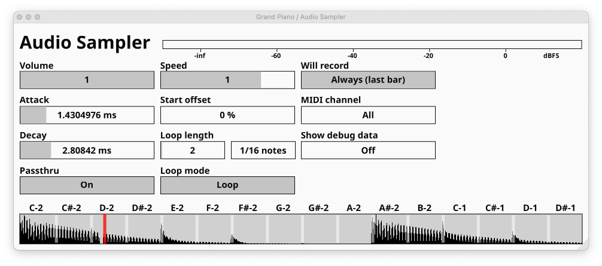

### audio-sampler

- Records audio and plays it back in a loop
- Behavior is controlled by MIDI events
- As precise & sample accurate as your DAW allows

- Note 0 (C-2) records audio while held
- Notes 12-27 (C#-1) start a new voice playing recorded audio back, each from next 16th offset of the buffer
- Note 1 (C#-2) reverses playback
- All other MIDI events are ignored
- No MIDI events are passed through

To get started using the plugin it should be enough to just try it.
However it may not be entirely obvious how some edge cases work, so here's a short description of the plugin's behavior:

- the playback and recording simulates two indepentent cursors moving through the buffer
- initially the buffer has zero length
- when recording starts, recording cursor is reset to beginning
- if recording cursor is at the end of the buffer, buffer gets extended
- once recording stops, buffer is trimmed to the length of the recording.
- playback can be started while recording is still in progress
- initial playback offset is determined by the length of the buffer when playback is started
- global playback speed multiplier is applied to all active and new voices
- note pitch changes speed multiplier for individual voices:
- +1 octave = note speed will be global speed * 2.0
- -1 octave = note speed will be global speed * 0.0
- -2 octaves = note speed will be global speed * -1.0

Plugin parameters

- Volume - output volume mulpilier
- Speed - playback speed multiplier. Applied to all active and new voices
- Attack - time in which playback volume is ramped up from 0 to 1 (linearly). Starts on note-on event
- Decay - time in which playback volume drops up from 1 to 0 (linearly). Starts on note-off event
- Pass through - disables/enables playing back incoming audio while no buffer playback voices are active
- Start offset - starting offset to play buffer from. Applied to all active and new voices
- Loop length - allows shortening down the looped portion of the buffer
- MIDI channel - MIDI channel over which controlling notes are received
- Show debug data - toggles displaying debug data on the plugin's UI
- Loop mode - toggles between looping and playing the loop region once
- Pitch speed multiplier - multiplier applied to polyphonic pitch events
